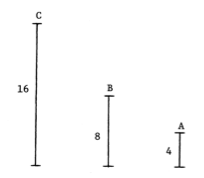
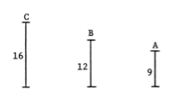
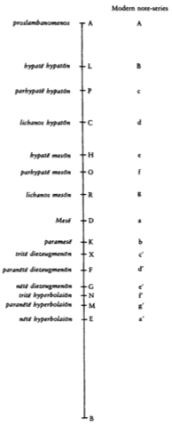
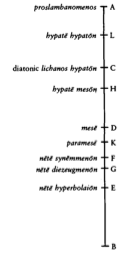

#### Proposition 10

*The octave interval is multiple.*

Let the nete of the hyperbolaion be A, the mese B, and the proslambanomenos C. Thus, interval AC, being a double octave, is consonant. 

Now it is either superparticular or multiple. It is not superparticular, for no mean fits in proportion with a superparticular interval. Therefore it is multiple. 

Since two intervals AB and BC added together make a multple whole, interval AB is therefore also multiple.

#### Proposition 11

*The interval of a fourth and of a fifth are each superparticular.*

Let the nete of the synemmenon be A, the mese B, and the hypate of the meson C. Thus, interval AC, being a double fourth, is dissonant. Therefore, it is not multiple. 

Now since two equal intervals, AB and BC, added together make a non-multiple whole, neither is AB multiple. And it *is* consonant. Thus it is superparticular. 

The same proof also applies to the fifth.

#### Proposition 19

*To mark the monochord according to the so-called immutable system.*

Let there be the length of the monochord, which is also the length of the string, AB, and let it be divided into four equal intervals by C, D, and E. 

There will therefore be BA, which is the lowest note. This AB is the sesquitertia of CB, so CB will be consonant with AB a fourth higher. 

AB is also the proslambanomenos. Therefore CB will be the diatonic hypaton. Moreover, since AB is the double of BD, it will be the consonant as an octave, and BD will be the mese. Moreover, since AB is the quadruple of EB, EB will be the nete hyperbolaion. 

I cut CB in two at F. And CB will be the duple of FB, so that CB is consonant as an octave with FB. So FB is the nete synemmenon. 

I take DG, the third part of DB. And DB will be the sesquialtera of GB, so DB will be consonant with GB as a fifth. Therefore, GB will be the nete diezeugmenon. 

I establish GH equal with GB, so HB will be consonant as an octave with GB, thus HB is the hypate meson. 

I take HK, the third part of HB. And HB will be the sesquialtera of KB, so KB is the paramese. 

I take LK, equal with KB, and LB will be the low hypate. 

Therefore, every note of the immutable system will be found on the monochord.

#### Proposition 20

*It remains necessary to consider the moveable notes.*

I cut EB in eight, and one equal part of these I establish EM, so MB becomes the sesquioctave of EB. Moreover, MB divides in eight, and one equal part of these I establish NM.

Therefore, by a tone, NB will be lower than BM, and MB than BE, so NB will be the trite hyperbolaion, and MB the diatonic hyperbolaion. 

I take the third part of NB and establish NJ, so JB is the sesquitertia of NB and is consonant as a fourth lower, and JB becomes the trite diezeugmenon.

Moreover, taking the half part of JB, I establish JO, so OB is consonant as a fifth with JB. Therefore, OB will be the parhypate meson.

And equal to JO, I establish OP, so PB becomes the parhypate hypaton. 

Now I take of BC a fourth part, CR, thus RB becomes the diatonic meson.

